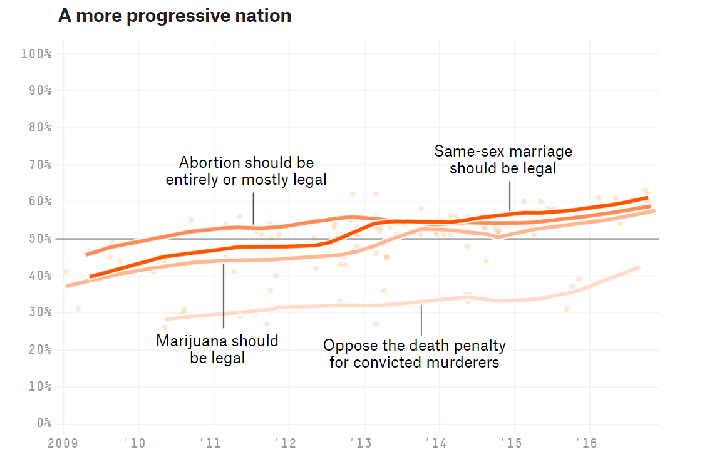
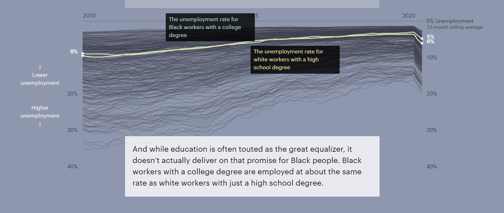

```{r setup, include=FALSE}
knitr::opts_chunk$set(echo = FALSE)
knitr::opts_knit$set(root.dir = rprojroot::find_rstudio_root_file())

library(tidyverse)
library(lubridate)
library(grid)
library(gridExtra)
library(gridtext)
library(lemon)
library(stringr)

source("include.R")
source("theme/theme_swd.R")


```

## Qué veremos hoy?

- Contexto:
    + Qué es Data Storytelling
    + Cuando usarlo
    + Ejemplos (pocos! y rápidos!) en comunicación masiva
    
- Data Storytelling
    + Lecciones en Data Storytelling
    + **Ejemplo (largo! detallado!) de Storytelling en contexto de negocios** 

- Cierre

## Qué es Data Storytelling?

**Lecciones narrativas + comunicación de datos**

-   Lecciones narrativas:

    -   Cómo estructurar la historia
    -   Cómo hacer que recuerden tu historia

-   Comunicación de datos efectiva

    -   Nivel de detalle acorde a la audiencia y al contexto
    -   Cómo las personas consumen información?

## Necesito Data Storytelling?

-   [Necesidad alta:]{style="color : red"} capturar audiencia, inducir una acción, audiencia no experta, situación Big Idea, periodismo de datos, comunicación masiva


-   [Necesidad media:]{style="color : orange"} audiencia cautiva, indicadores rutinarios, audiencia experta, future-proofing


-   [Baja necesidad:]{style="color : gray"} análisis exploratorio, almacenamiento de datos, auditoría


## Data Storytelling en negocios

-   Primera asociación es con periodismo de datos, audiencias masivas

-   Sin embargo, es muy útil en contextos de negocios

    -   audiencia con tiempo limitado

    -   audiencia debe escuchar presentaciones que no son de su especialidad

    -   interacciones dedicadas a la toma de decisiones

-   Énfasis difieren, conjunto de lecciones es similar


## Ejemplo: equipo de atención al cliente

-   Equipo de especialistas en Mesa de Ayuda (EMAs). Reciben y procesan órdenes ("tickets")

-   Dos miembros se fueron. Hay atrasos en el procesamiento de los tickets.

-   La gerencia tomó nota del atraso. Te llaman, como jefe de equipo, a una reunión informativa.

-   Tu objetivo: mejorar imagen de tu equipo y conseguir refuerzos.

## Primer impulso: mostrar los datos {.build}

Tickets de servicio: datos de procesados versus recibidos

```{r tickets-data, include=FALSE, cache=TRUE}
df_t <- read_csv(file.path("data","FIG0410-14.csv")) %>% rename(ticket_type = X1) %>%
  mutate(ticket_type = forcats::fct_rev(factor(case_when(ticket_type == "Ticket Volume Received" ~ "Received",
                                 ticket_type == "Ticket Volume Processed" ~ "Processed")))) %>%
  pivot_longer(cols = !ticket_type, names_to = "month", values_to = "tickets") %>%
  mutate(date = lubridate::ymd(paste0("2000-",match(month,month.abb),"-01"))) %>% 
  mutate(ticket_type_es = ifelse(ticket_type=="Received", "Recibidos",
                                 "Procesados"))

```

```{r tickets-mostrar-los_datos, echo=FALSE, cache=TRUE}

pt_md <- df_t %>% ggplot(aes(x = date, y = tickets, group = ticket_type)) + 
  geom_col(aes(fill = ticket_type), position = "dodge") +  
  geom_text(
    aes(label = tickets),
    vjust = -0.45,
    position = position_dodge(width = 22),
    size = 2
    ) + 
  theme_bw() + 
  theme(legend.position = "bottom")

print(pt_md)
```

## Forma sigue a la función

Tendencia y brechas: líneas es mejor que barras.

```{r tickets-lineas-code, echo=FALSE, cache=TRUE}

pt_li <- df_t %>% ggplot(aes(x = date, y = tickets, color = ticket_type)) + 
  geom_line() + 
  geom_point(aes(shape = ticket_type)) + 
  theme_bw() + 
  theme(legend.position = "bottom")

print(pt_li)

```

## Llama a Marie Kondo, bota cachureos

Remover líneas verticales, horizontales y marcadores de datos

```{r tickets-declutter, echo=FALSE, cache=TRUE}

pt_dc <- df_t %>% ggplot(aes(x = date, y = tickets, color = ticket_type)) + 
  geom_line() + 
  theme_classic() + 
  theme(legend.position = "bottom",
        panel.grid = element_blank())  

print(pt_dc)
  
  

```

## **Anotar** es mejor que *legendar*

Leyendas suelen distraer y requieren más esfuerzo cognitivo

```{r tickets-annotationoverlegend, echo=FALSE, cache=TRUE}

pt_an <- df_t %>% ggplot(aes(x = date, y = tickets, color = ticket_type)) + 
  geom_line() + 
  theme_classic() + 
  theme(legend.position = "none",
        panel.grid = element_blank()) + 
  annotate(geom = "text", label = "Recibidos", 
           x = as.Date("2000-11-30"), y = 182, size = 4)  + 
  annotate(geom = "text", label = "Procesados", 
           x = as.Date("2000-11-30"), y = 145, size = 4) +
  coord_cartesian(clip = "off") 

print(pt_an)

```

## Use el color para reforzar

Colores ya asociados a Recibidos y Procesados. Mantenerlo así.

```{r tickets-colorconsistente, echo=FALSE, cache=TRUE}

pt_cc <- df_t %>% ggplot(aes(x = date, y = tickets, color = ticket_type)) + 
  geom_line() + 
  theme_classic() + 
  theme(legend.position = "none",
        panel.grid = element_blank()) + 
  annotate(geom = "text", label = "Recibidos", color="red",
           x = as.Date("2000-11-30"), y = 182, size = 4)  + 
  annotate(geom = "text", label = "Procesados", color="blue",
           x = as.Date("2000-11-30"), y = 145, size = 4) +
  coord_cartesian(clip = "off") + 
  scale_color_manual(values = c("Received" = "red",
                                "Processed" = "blue"))

print(pt_cc)

```

## Concentre la atención

```{r tickets-atencion, echo=FALSE, cache=TRUE}
pt_at <-
  ggplot(df_t) + 
  geom_line(aes(x = date, y = tickets, color = ticket_type), size = 2) +
  geom_point(aes(x = date, y = tickets, color = ticket_type),
    size = 4,
    data = df_t %>% filter(date >= ymd("2000-08-01"))
             ) +
  geom_text(aes(x = date, y = tickets, color = ticket_type, 
                label = tickets), nudge_y = 19, size = 4,
            data = df_t %>% filter(date >= ymd("2000-08-01"),
                                   ticket_type == "Received")
            ) +
  geom_text(aes(x = date, y = tickets, color = ticket_type,
                label = tickets), nudge_y = -19, size = 4,
            data = df_t %>% filter(date >= ymd("2000-08-01"), 
                                   ticket_type == "Processed")
            ) +
  geom_text(aes(x = date, y = tickets, color = ticket_type,
                label = ticket_type_es), nudge_x = 5, hjust = 0,
            size = 5, data = df_t %>% filter(month == "Dec")
            ) +
  geom_vline(xintercept = ymd("2000-05-01"), color = GRAY8) +
  scale_x_date(date_labels = "%b",
               date_breaks = "1 month",
               expand = c(0, 0)) +
  scale_y_continuous(breaks = seq(0, 300, 50), limits = c(0, 300)) +
  scale_color_manual(values = c("Received" = GRAY7, "Processed" = BLUE1),
                     guide = NULL) +
  coord_cartesian(clip = "off") +
  labs(
    title = "Volumen de tickets en el tiempo",
    caption = "Fuente: Dashboard de tickets al 12/31/2020 | Se hizo un análisis detallado de tickets por persona\npara sustentar esta petición y está disponible, a petición de los interesados.",
    x = "2020",
    y = "Número de tickets"
  ) + 
  theme_minimal() + 
  theme(panel.grid.major = element_blank(),
        panel.grid.minor = element_blank(),
        axis.line = element_line(color = GRAY9),
        axis.title.y = element_text(color = GRAY8, hjust = 1),
        axis.title.x = element_text(color = GRAY8, hjust = 0),
        axis.ticks = element_line(color = GRAY9),
        axis.text = element_text(color = GRAY8, size = 12),
        plot.margin = unit(c(1,4,1,1), "cm"),
        plot.title = element_text(size = 18),
        plot.caption = element_text(color = GRAY8,
                                    hjust = 0,                                                               margin = margin(
                                      .3,0,0,0,"cm"))
                  )

print(pt_at)
```

## Entregue un contexto

```{r tickets-after-code, echo=FALSE, cache=TRUE}

grob_explanation <- grobTree(richtext_grob(
  "<span style='background-color:white'><b>2 personas renunciaron en Mayo.</b> Redoblamos esfuerzos, pero el <br>volumen de Agosto dejó una brecha que aún no podemos cerrar</span>", 
  x=0.35,  y=0.95, hjust=0, gp=gpar(col = GRAY3, fontsize=11), box_gp = gpar(col = "white", fill = "white"),
  padding = margin(.4,0,0,0,"in")))

pt_af <-
  ggplot(df_t) + 
  geom_line(aes(x = date, y = tickets, color = ticket_type), size = 2) +
  geom_point(aes(x = date, y = tickets, color = ticket_type),
    size = 4,
    data = df_t %>% filter(date >= ymd("2000-08-01"))
             ) +
  geom_text(aes(x = date, y = tickets, color = ticket_type, 
                label = tickets), nudge_y = 19, size = 4,
            data = df_t %>% filter(date >= ymd("2000-08-01"),
                                   ticket_type == "Received")
            ) +
  geom_text(aes(x = date, y = tickets, color = ticket_type,
                label = tickets), nudge_y = -19, size = 4,
            data = df_t %>% filter(date >= ymd("2000-08-01"), 
                                   ticket_type == "Processed")
            ) +
  geom_text(aes(x = date, y = tickets, color = ticket_type,
                label = ticket_type_es), nudge_x = 5, hjust = 0,
            size = 5, data = df_t %>% filter(month == "Dec")
            ) +
  geom_vline(xintercept = ymd("2000-05-01"), color = GRAY8) +
  scale_x_date(date_labels = "%b",
               date_breaks = "1 month",
               expand = c(0, 0)) +
  scale_y_continuous(breaks = seq(0, 300, 50), limits = c(0, 300)) +
  scale_color_manual(values = c("Received" = GRAY7, "Processed" = BLUE1),
                     guide = NULL) +
  coord_cartesian(clip = "off") +
  labs(
    title = "Volumen de tickets en el tiempo",
    caption = "Fuente: Dashboard de tickets al 12/31/2020 | Se hizo un análisis detallado de tickets por persona\npara sustentar esta petición y está disponible, a petición de los interesados.",
    x = "2020",
    y = "Número de tickets"
  ) +
  annotation_custom(grob_explanation) + 
  theme_minimal() + 
  theme(panel.grid.major = element_blank(),
        panel.grid.minor = element_blank(),
        axis.line = element_line(color = GRAY9),
        axis.title.y = element_text(color = GRAY8, hjust = 1),
        axis.title.x = element_text(color = GRAY8, hjust = 0),
        axis.ticks = element_line(color = GRAY9),
        axis.text = element_text(color = GRAY8, size = 12),
        plot.margin = unit(c(1,4,1,1), "cm"),
        plot.title = element_text(size = 14),
        plot.caption = element_text(color = GRAY8,
                                    hjust = 0,                                                               margin = margin(
                                      .3,0,0,0,"cm"))
                  )

print(pt_af)

```

## Quiere algo? Pídalo!

```{r conpatch, fig.height=5.4, cache=TRUE}
library(patchwork)

pt_af + 
  plot_annotation(
    title = "Por favor aprobar contratación de dos nuevos EMAs",
    subtitle = "para recuperar los que se fueron el año pasado.",
    theme = theme(plot.title = element_text(size = 20, 
                                            face = "bold"),
                  plot.subtitle = element_text(size = 10,
                                            color = GRAY8)) 
  )
```

## Lecciones en Data Storytelling

-   Contexto: quién, qué, cómo?

-   Elementos visuales más efectivos

-   Botar cachureos

-   Concentrar y guiar la atención

-   Asegurar el mensaje


## DST en comunicación masiva (I)

FiveThirtyEight: cómo cambió USA durante Obama?

{width="80%"}

## DST en comunicación masiva (II)

ProPública: trabajo y racismo en USA

{width="100%"}


## Herramientas/Aprendizaje

-   Estas lecciones **no** dependen de la herramienta escogida

-   Dicho eso, necesita aprender al menos una :-)

-   **Ven a aprender Data Storytelling con nosotros!**

    -   Datos + Herramientas + Historias

-   Este webinar: **todo** hecho desde `R`

    -   Gráficos: ggplot2
    -   Presentación: ioslides + RMarkdown

-   Código y presentación disponible aquí: https://github.com/ricardomayerb/webinar-data-st-viz

## Créditos

-   Ejemplo original de Cole Nussbaumer Knaflic, en Storytelling with Data.

-   Código R creado a partir del código de Adam Ribaudo

<!-- ## Lecciones del Data Storytelling -->

<!--   + Facilitar identificación y retención: contexto, conflicto y resolución. Mencionar humanos. -->

<!--   + Facilitar la comprensión: elegir elemento que más fácil de comprender. Anotaciones >> leyendas.  -->

<!--   + Concentrar la atención: eliminar distracciones, inconsistencias y  exceso de información. -->

<!--   + Guiar la atención: destacar lo que deben entender mejor. Apagar el resto. -->


## Gracias!!

- Bueno, eso es todo :-)

- Preguntas?


